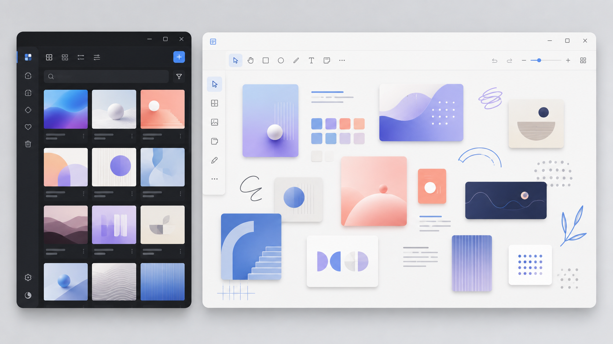
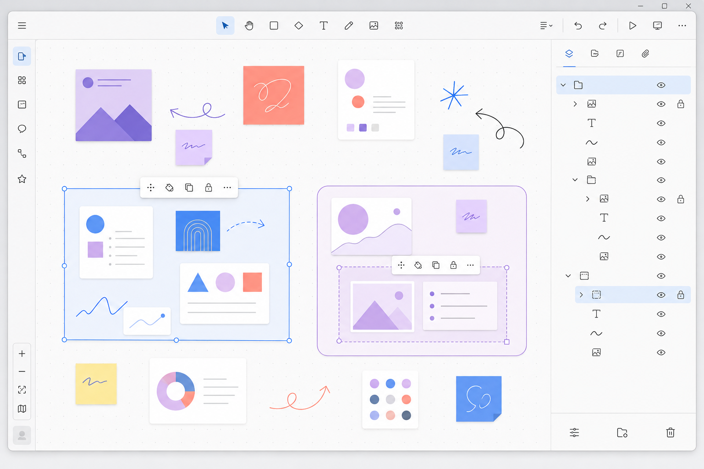
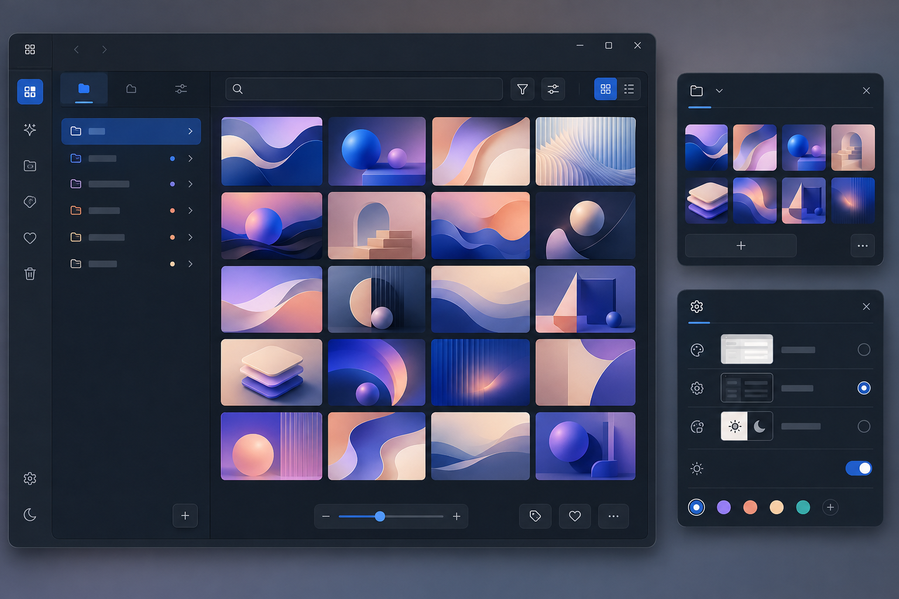

# MuseBox

<p align="center">
  
</p>

<p align="center"><strong>把零散灵感收进抽屉，再放到自由画板上继续整理。</strong></p>


MuseBox 是一款面向 Windows 的本地灵感收集与视觉整理工具。它可以快速接收截图、剪贴板图片和本地文件，并通过抽屉、自由画板、文字、绘制、组合与图层，把零散素材整理成可继续编辑的视觉场景。

> 当前版本：1.1.21 · Windows 10/11 · .NET 8 WPF



> 上图及下方界面图均为生成式暂代示意，不包含真实用户图片或真实使用数据；实际界面请以当前版本为准。

## 界面与图标

<table>
  <tr>
    <td align="center" width="33%"><br /><sub>应用图标</sub></td>
    <td align="center" width="33%"><br /><sub>.mubo 场景图标</sub></td>
    <td align="center" width="33%"><br /><sub>沉浸收集图标</sub></td>
  </tr>
</table>

### 自由画板、组合与图层



画板支持图片、文字和绘制内容混合排布，并可通过组合背景和树形图层管理复杂结构。

### 快速收集与外观



抽屉式素材管理、沉浸收集小窗以及浅色、深色和跟随系统外观共同构成完整的桌面工作流。

## 核心功能

- **快速收集**：接收截图、剪贴板图片及本地图片，随时保存到素材库。
- **抽屉整理**：使用抽屉分类管理素材，在主窗口与沉浸式小窗之间快速切换。
- **自由画板**：在可缩放、平移的画布上摆放图片、文字和绘制内容。
- **组合与嵌套**：支持混合组合图片、文字和绘制元素；可设置组合背景、边框、锁定与自动收纳，并允许多层嵌套。
- **图层面板**：查看完整父子层级，选择、重命名、排序以及将元素拖入或拖出组合。
- **图片处理**：提供裁剪、旋转、翻转、透明度与颜色调整等常用编辑能力。
- **GIF 支持**：可导入、预览、逐帧浏览和控制 GIF 动图素材。
- **场景文件**：通过 `.mubo` 保存可编辑画板，保留元素布局、变换、分组和图层信息。
- **链接与注释**：为素材附加说明和网页、文件或文件夹链接，便于回到内容来源。
- **外观适配**：支持浅色、深色和跟随系统主题，并提供画板背景与透明度设置。
- **画板模式**：支持鼠标穿透、透明编辑及相对指定应用窗口的智能置顶。

## 快速开始

### 从源码运行

需要安装 [.NET 8 SDK](https://dotnet.microsoft.com/download/dotnet/8.0)，运行系统为 Windows 10/11。

```powershell
git clone https://github.com/Xxuebi/MuseBox.git
cd MuseBox
dotnet restore .\MuseBox.sln
dotnet run --project .\MuseBox.csproj
```

### 构建与测试

```powershell
dotnet build .\MuseBox.sln -c Release
dotnet run --project .\MuseBox.Tests\MuseBox.Tests.csproj -c Release
```

生成 Windows x64 自包含便携版：

```powershell
dotnet publish .\MuseBox.csproj -p:PublishProfile=win-x64
```

发布产物位于 `publish\v<版本号>`，该目录不会提交到 Git。

## 基本使用

1. 从剪贴板、截图或本地文件加入图片，并使用抽屉进行分类。
2. 打开画板，将素材拖入画布；滚轮缩放，拖动画布平移视图。
3. 添加文字或绘制内容，框选多个元素后创建组合。
4. 使用组合工具栏调整背景、边框、锁定和自动收纳行为。
5. 打开图层面板管理前后顺序与嵌套关系；列表顶部代表画布前景。
6. 将当前工作保存为 `.mubo` 场景，之后可继续编辑。

### 图层与组合

- 单击普通图层会同步选择对应画布元素；单击组合行会选择该组合。
- 按住 `Shift` 或 `Ctrl` 可以多选元素。
- 双击图层可在保持当前缩放比例的情况下将图片、文字、绘制或组合居中。
- 组合锁定时，单击内部元素会选择外层锁定组；逐层双击可临时进入嵌套组合并选择具体元素。
- 拖动图层行可调整同级顺序，拖到组合中可改变父子关系，拖出缩进范围可移至上级或根级。
- 组合背景范围会根据全部后代实时计算，外层背景始终位于内层背景与内容之后。

### 排列与对齐

画板右键菜单的“排列”包含自动排列、左对齐、右对齐、上对齐、下对齐、水平分布和垂直分布，适用于图片、文字、绘制和组合。

- 没有选择时处理整个画板；有选择时只处理选中范围，完整组合保持内部布局。
- 四向对齐各有普通对齐与等距排列子项：普通对齐只贴齐指定边；左／右等距排列为单列，上／下等距排列为单行，间距固定为 18 个画板单位。
- 水平分布为上下居中的横向胶片排列；垂直分布为左右居中的纵向排列，均使用 18 个画板单位的间距。
- 所有排列至少需要两个排列单位；仅选中一个时禁用，不回退到全画板。各操作支持撤回和重做。
- 自动排列保留快捷键 `Ctrl+Alt+G`；对齐、分布以及选区自动排列不改变当前视图。

### 画板模式

- “无视鼠标”会隐藏画板操作界面并让鼠标事件穿透到后方应用，同时临时保持画板置顶。
- “画板透明”隐藏背景和常驻界面，但仍可选择、移动、缩放、旋转及编辑画板元素。
- “智能置顶”允许点击选择一个外部应用窗口，使画板保持在该窗口上方，同时允许其他窗口覆盖画板。
- 默认使用 `Ctrl+Shift+F12` 退出最近进入的画板模式，也可通过任务栏或 MuseBox 托盘菜单退出。

## 场景兼容性

当前 `.mubo` 场景格式为版本 2，包含组合实体、图层名称和嵌套关系。MuseBox 仍可读取版本 1 场景，并在载入时迁移旧组合数据。

为避免破坏原文件，建议在导入重要旧场景前保留备份。

## 项目结构

```text
MuseBox/
├─ Application/            应用级场景与托盘逻辑
├─ Assets/                 图标与界面资源
├─ Controls/               自定义 WPF 控件
├─ docs/                   格式与验证文档
├─ Installer/              Inno Setup 安装脚本
├─ Models/                 数据模型
├─ Services/               剪贴板、场景、图层等服务
├─ Views/
│  ├─ Main/                主窗口与抽屉交互
│  ├─ Board/               画板窗口及功能分片
│  ├─ Editors/             图片、链接与颜色编辑器
│  ├─ Settings/            全局及画板设置
│  ├─ Dialogs/             通用对话框
│  └─ Overlays/            截图、取色与封面覆盖层
├─ MuseBox.Tests/          自动化测试
├─ MuseBox.ThumbnailProvider/  场景缩略图扩展
├─ MuseBox.csproj          主程序项目
└─ MuseBox.sln             Visual Studio 解决方案
```

部分文件夹可能随功能演进调整，请以当前源码为准。

## 数据与隐私

MuseBox 的素材索引、设置和画板数据默认保存在本机用户目录 `%LocalAppData%\MuseBox`。导入的图片会复制到本地资料库并按 SHA-256 去重，应用不会上传图片。旧版 `%LocalAppData%\InspirationCollector` 数据会在首次启动时兼容迁移。

卸载或替换便携版程序不会自动迁移用户数据；备份时请同时保存重要的 `.mubo` 场景和本地素材。

## 参与开发

欢迎通过 [Issues](https://github.com/Xxuebi/MuseBox/issues) 报告问题或提出建议。提交代码前请确保 Release 构建成功，并运行现有测试。

版本变化请查看 [CHANGELOG.md](CHANGELOG.md)。

## 许可证

MuseBox 使用 [MIT License](LICENSE) 开源。
