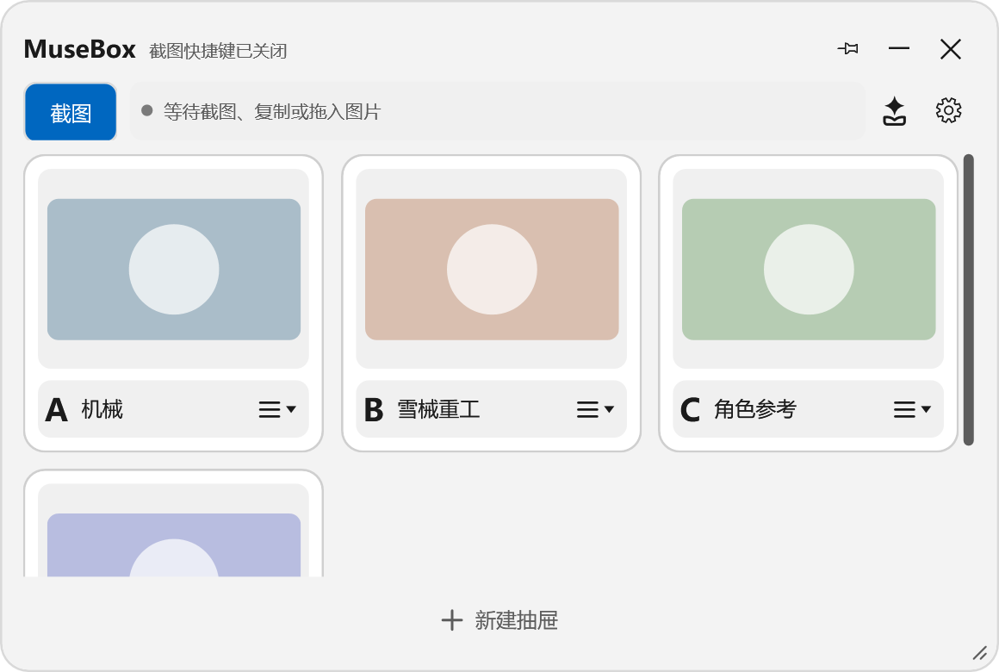
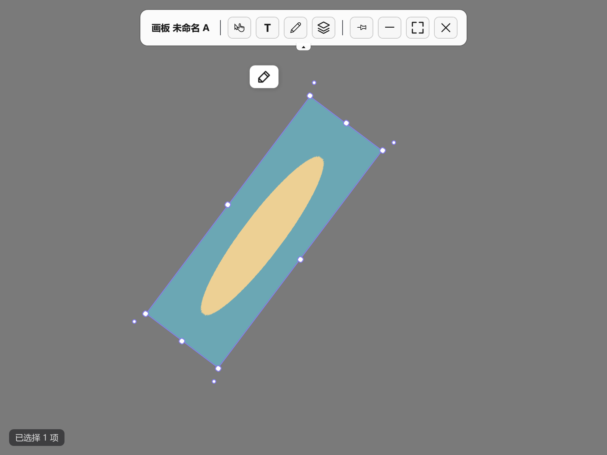

# MuseBox

<p align="center">
  
</p>

<p align="center"><strong>把截图、图片和灵感收进抽屉，在自由画板上继续整理。</strong></p>

<p align="center">
  <a href="https://github.com/Xxuebi/MuseBox/releases/latest"></a>
  
  
  <a href="LICENSE"></a>
</p>

MuseBox 是一款面向 Windows 的本地图片收集与视觉整理工具。它可以接收截图、剪贴板图片和本地文件，并通过抽屉、自由画板、文字、绘制、组合与图层，把零散素材整理成可继续编辑的场景。

## 下载

**[前往 GitHub Releases 下载最新便携版](https://github.com/Xxuebi/MuseBox/releases/latest)**

当前版本：**1.1.26**

1. 下载 `MuseBox-v1.1.26-portable.zip`。
2. 解压到任意独立文件夹。
3. 运行 `MuseBox.exe`。

便携版需要 Windows 10/11 与 [.NET 8 Desktop Runtime](https://dotnet.microsoft.com/download/dotnet/8.0)。应用数据默认保存在 `%LocalAppData%\MuseBox`，升级程序不会自动删除素材库；重要画板仍建议另存为 `.mubo` 文件备份。

## 当前界面



> 由 MuseBox 1.1.26 的实际 WPF 控件渲染，使用测试用演示抽屉与占位素材，不包含用户数据。



> 画板截图同样来自当前版本的真实界面渲染；画面内容是程序生成的演示图形，不是真实工程或个人素材，界面控件未作重绘。

## 主要功能

- **快速收集**：接收截图、剪贴板图片和本地图片，按抽屉分类整理。
- **自由画板**：缩放、平移、旋转和调整图片，也可添加文字与绘制内容。
- **组合与图层**：支持图片、文字、绘制混合组合、多层嵌套、锁定、重命名和拖动排序。
- **排列工具**：自动排列、四向对齐、等距排列以及水平／垂直分布。
- **图片编辑**：裁剪、旋转、翻转、透明度与颜色调整，并支持 GIF 预览和逐帧浏览。
- **网格与吸附**：线／点网格随画板缩放细分，可独立启用移动吸附。
- **场景文件**：使用 `.mubo` 保存可继续编辑的画板、层级、组合和视图状态。
- **灵活导出**：按模板批量导出原图或转换为 PNG、JPG、BMP，也可合成透明 PNG。
- **画板模式**：提供鼠标穿透、透明编辑和相对指定应用窗口的智能置顶。
- **本地优先**：素材索引、设置和画板数据保存在本机，不会由 MuseBox 主动上传。

## 快速使用

1. 复制图片、截图或拖入本地图片，在主窗口中选择抽屉保存。
2. 打开画板并放置素材；使用文字、绘制和组合继续整理。
3. 在图层面板管理顺序与父子关系，或通过右键菜单排列所选内容。
4. 使用“保存”将工作另存为 `.mubo`，使用“导出”输出单张资源或合成图片。

常用画板快捷键：

| 操作 | 快捷键 |
| --- | --- |
| 复制 / 粘贴 | `Ctrl+C` / `Ctrl+V` |
| 撤回 / 重做 | `Ctrl+Z` / `Ctrl+Y` |
| 保存 / 另存为 | `Ctrl+S` / `Ctrl+Shift+S` |
| 自动排列 | `Ctrl+Alt+G` |
| 适应全部 | `Ctrl+0` |
| 组合 / 解散组合 | `Ctrl+G` / `Ctrl+Shift+G` |
| 退出画板模式 | `Ctrl+Shift+F12` |

快捷键可在设置中修改；低频命令默认不占用按键。

## 从源码构建

需要 Windows 10/11 和 [.NET 8 SDK](https://dotnet.microsoft.com/download/dotnet/8.0)。

```powershell
git clone https://github.com/Xxuebi/MuseBox.git
cd MuseBox
dotnet restore .\MuseBox.sln
dotnet build .\MuseBox.sln -c Release
dotnet run --project .\MuseBox.Tests\MuseBox.Tests.csproj -c Release
```

生成便携版：

```powershell
dotnet publish .\MuseBox.csproj -c Release -o .\publish\v1.1.26 --no-self-contained
```

## 项目结构

```text
MuseBox/
├─ Assets/                     图标与应用资源
├─ Controls/                   自定义 WPF 控件
├─ Models/                     数据模型
├─ Services/                   场景、图层、导出与资料库服务
├─ Views/                      主窗口、画板、编辑器、设置与对话框
├─ MuseBox.Tests/              自动化测试
├─ MuseBox.ThumbnailProvider/  .mubo 资源管理器缩略图组件
└─ Installer/                  安装包脚本
```

版本变化见 [CHANGELOG.md](CHANGELOG.md)，问题与建议请提交到 [Issues](https://github.com/Xxuebi/MuseBox/issues)。

## 许可证

MuseBox 使用 [MIT License](LICENSE) 开源。
